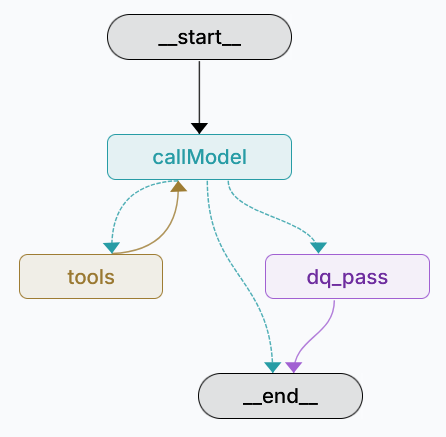

# docs/AGENTS.md

[← Back to README](../README.md)

## Purpose of this document

This file describes the two LangGraph agents contained in this repository and explains how they support the study
design. The focus is on the **data-aware assistant** and the embedded **data-quality (DQ) evaluation** that
operationalizes the indicator **TIMELINESS** as part of the study.

## Agent overview

This repository contains two LangGraph agents:

1) **tavilyAgent (development template)**  
   `tavilyAgent` is a small, generic template agent used during development to test concepts and new features on a
   simple graph workflow. It is not required to run the study system and exists mainly for prototyping and debugging.

2) **dataAwareLLMSystem (study agent)**  
   `dataAwareLLMSystem` is the main study agent. It supports participants in formulating correct, safe, and reproducible
   SQL queries against the dataset database and, in a second internal pass, computes a **TIMELINESS** assessment that
   can be shown in Study-Variant 2 via the side panel.

---

## dataAwareLLMSystem: research-oriented design goals

The `dataAwareLLMSystem` is designed for an interactive study context in which participants may have limited knowledge
about SQL and limited experience with AI systems. The agent therefore aims to:

- **Reduce errors in indicator selection** by enforcing a structured “indicator resolution” step before running value
  queries.
- **Reduce erroneous aggregation and misinterpretation** by preferring clarifying questions over broad or speculative
  queries.
- **Maintain strict separation** between (a) user-facing analytical assistance and (b) internal data-quality evaluation,
  in order to support the study manipulation.

---

## High-level workflow

The agent run consists of two phases executed in a single graph run:

1) **Main assistant phase (user-visible)**  
   A tool-augmented assistant generates clarifying questions and/or read-only SQL queries to answer the user’s request.
   The produced answer is shown in the chat.

2) **DQ pass phase (not user-visible)**  
   Immediately after the final user-visible answer, a second internal pass evaluates the **timeliness** of the *actually
   used data footprint* (based on all SQL queries executed in the main phase). The DQ result is persisted to the App
   database and can be displayed only in Variant 2.

---

## Architecture and components (main assistant phase)

### Workflow diagram (LangGraph)

### Schema grounding (dataset schema summary)

At the beginning of a run, the agent loads a compact schema summary of the dataset database via introspection (
`information_schema.columns`). This summary is injected into the system prompt as `{dataset_schema}`. The objective is
to increase SQL correctness and reduce trial-and-error queries by providing the model with a structured view of
available tables and columns.

**Implementation anchor:**

- `app/modules/langgraph/agents/dataAwareLLMSystem/utils/get-dataset-schema-summary.ts` (cached per process)
- `app/modules/langgraph/agents/dataAwareLLMSystem/tools/schema-introspect.ts` (explicit tool for schema exposure)

### System prompt constraints and study rule (no timeliness hints)

The main assistant’s system prompt is explicitly designed to support users in producing correct analytical queries while
enforcing a critical study rule:

- **The assistant must not comment on the suitability of temporal coverage** (e.g., missing years/months, outdated data,
  insufficient range) in user-visible chat responses.

Example implication:  
If the user requests an average “up to 2025” but the data coverage ends earlier, the assistant must still compute the
result based on available data and **must not warn** that 2025 is missing. This restriction ensures that
timeliness-related judgments remain exclusively part of the DQ pass and (depending on study condition) the side panel.

**Implementation anchor:**

- `app/modules/langgraph/agents/dataAwareLLMSystem/prompts.ts` (`SYSTEM_PROMPT_TEMPLATE`)

### Indicator resolution (mandatory before value queries)

The agent enforces a structured process to resolve the **exact indicator(s)** used for analysis. Instead of guessing
indicator names from natural language, the assistant first runs a bounded lookup query to identify candidate indicators
that match the user’s concept (keywords/synonyms). The user is then asked to confirm the correct indicator if multiple
plausible matches exist.

This mechanism reduces the risk of:

- silently mixing similar indicators,
- selecting an unintended unit/definition,
- producing results that are irreproducible or misleading.

**Design rationale:**  
In ESG settings, many indicator names are semantically close (e.g., emissions vs. scope-specific emissions, diversity
variants, different denominators). Enforcing indicator disambiguation improves transparency and supports a broader user
population.

### Tool-augmented reasoning with a bounded ReAct loop

The main assistant runs in a ReAct-style loop:

- If the request is ambiguous, the agent asks clarifying questions.
- If sufficient constraints exist (indicator + entity scope + timeframe), the agent generates a read-only SQL query via
  `sql_query`.
- Returned rows are used to produce a natural-language answer.

The toolchain is intentionally minimal:

- `get_dataset_schema` (schema summary)
- `sql_query` (read-only dataset SQL)

**Implementation anchor:**

- `app/modules/langgraph/agents/dataAwareLLMSystem/tools/sql-query.ts` (Postgres pool + statement timeout + max rows)
- `app/modules/langgraph/agents/dataAwareLLMSystem/utils/sql-guard.ts` (read-only enforcement + sanitization)

---

## Data-quality (DQ) pass: TIMELINESS evaluation (internal)

### Purpose and separation from user-visible output

The DQ pass exists to compute a **TIMELINESS** assessment without contaminating the main assistant’s user-facing
behavior. The DQ output:

- is **not** appended as a chat message,
- is persisted to the App DB (append-only),
- is shown only when the study UI enables the side panel (Variant 2).

### Definition of TIMELINESS used in this study

Timeliness refers to the extent to which data are sufficiently current and temporally appropriate for a specific task or
decision context. It evaluates whether the available data cover the required time period without relevant gaps and
whether their currency meets the user’s analytical needs; because timeliness is task-dependent, data may be considered
only partially timely if observed temporal coverage does not fully match the requested timeframe. (Wang & Strong, 1996)

**Reference (APA 7):**  
Wang, R. Y., & Strong, D. M. (1996). Beyond accuracy: What data quality means to data consumers. *Journal of Management
Information Systems, 12*(4), 5-33.

### Inputs to the DQ pass

The DQ system receives:

- the user’s request context, based on the **full chat history** (USER + ASSISTANT), to avoid losing timeframe
  constraints introduced in earlier turns,
- **all SQL queries** executed in the main assistant phase (`all_sql_used`),
- the dataset schema summary.

This design addresses a common conversational pattern: users may first specify a timeframe (e.g., “2018-2023”) and later
answer a clarification (“Adidas”), so the DQ system must see the full context to correctly infer the intended temporal
requirements.

### Coverage computation (not only MIN/MAX)

A key requirement of this study’s timeliness measurement is **continuity checking** within the requested interval. The
DQ pass must detect missing buckets inside a range (e.g., missing years between 2016 and 2023), not only evaluate
observed minimum and maximum.

Operationally, the DQ pass:

1) infers the requested timeframe (explicit range, single bucket, or relative phrases resolved against `system_time`),
2) derives observed time buckets from the actually used data footprint,
3) computes expected buckets via `generate_series(...)`,
4) calculates missing buckets as expected minus observed.

This produces evidence for one of the following statuses:

- **OK:** requested interval is fully covered; no relevant missing buckets,
- **PARTIAL:** interval overlaps, but internal gaps exist or coverage is incomplete,
- **MISMATCH:** observed coverage is clearly outside the requested timeframe or overlaps meaningfully insufficient,
- **UNKNOWN:** SQL executed, but timeframe/buckets could not be derived confidently (or evidence is insufficient),
- **NOT_EVALUATED:** only if the main assistant did not execute any dataset query at all.

### Persistence and linkage

The DQ pass persists exactly one log row per user turn to the App DB, linked by `langGraphThreadId` (LangGraph
`thread_id`). Stored fields include:

- `indicators` (JSON containing TIMELINESS),
- `usedTables` (best-effort union of tables extracted from all SQL queries),
- `mainSql` and `dqSql` (optional audit/debug support).

This enables:

- transparent provenance display (“which tables contributed”),
- deterministic reconstruction for analysis,
- condition-specific UI display (Variant 2 side panel).

**Implementation anchor:**

- `app/modules/langgraph/agents/dataAwareLLMSystem/persist/write-thread-dq-log.ts`
- Prisma model: `ThreadDataQualityLog` (App DB)

---

## Study condition integration (Variant 1 vs Variant 2)

Both study variants use the same core assistant capabilities for answering user requests and generating SQL. The key
difference is **visibility** of the data-quality evaluation:

- **Variant 1:** No timeliness indicator is shown to participants (even though internal logging may still exist
  depending on configuration).
- **Variant 2:** The side panel can display the latest TIMELINESS result for the current thread by reading the newest
  `ThreadDataQualityLog` entry.

This separation is central to evaluating whether presenting a data-quality indicator (TIMELINESS) influences user
perceptions such as trust and perceived transparency.

---

[← Back to README](../README.md)
